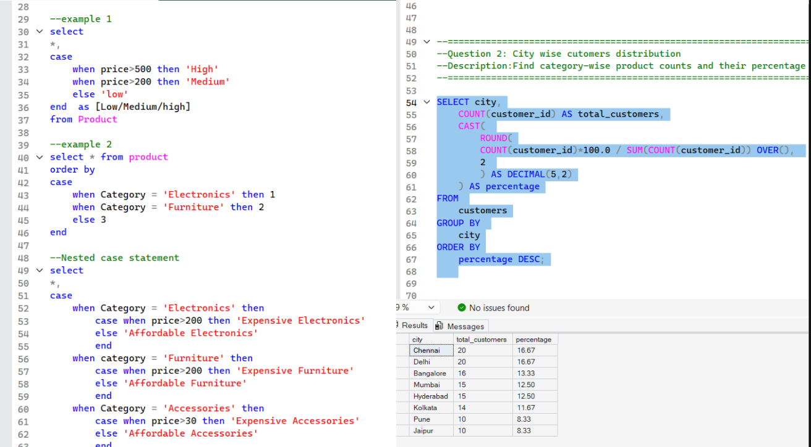

# SQL for Data Analytics

This folder contains hands-on SQL practice and mini analysis projects completed using Microsoft SQL Server as part of my Data Analytics learning journey.

The focus was to develop practical SQL skills for querying, cleaning, transforming, and analyzing structured data.

## Tools

* Microsoft SQL Server
* SQL Server Management Studio (SSMS)
* CSV Datasets

## Concepts Covered

* Data Retrieval & Filtering
* Aggregations & Reporting
* GROUP BY & HAVING
* CASE Statements
* Joins
* Duplicate Detection
* Pattern Matching using LIKE

## Folder Structure

```text
02_ms_sql/
│
├── dataset/
│   └── ecommerce_practice_dataset.csv
│
├── screenshot/
│   └── city_wise_customer_distribution.png
│
├── sql_queries/
│   ├── case_statement.sql
│   ├── duplicates.sql
│   ├── e_commerce_data_analysis.sql
│   ├── join_practise_1.sql
│   ├── joins_practise_2.sql
│   └── like_statement.sql
│
└── README.md
```

## Preview



## Practice Files

| File                         | Description                             |
| ---------------------------- | --------------------------------------- |
| case_statement.sql           | Conditional logic using CASE statements |
| duplicates.sql               | Detecting duplicate records             |
| e_commerce_data_analysis.sql | E-commerce data analysis queries        |
| join_practise_1.sql          | Join practice exercises                 |
| joins_practise_2.sql         | Multi-table analysis using joins        |
| like_statement.sql           | Pattern matching using LIKE             |

## Skills Gained

* SQL Query Writing
* Data Filtering & Aggregation
* Multi-Table Analysis
* Data Cleaning Logic
* Business Data Analysis
* Reporting-Oriented Query Development

## Outcome

After completing this section, I can:

* Extract insights from structured datasets
* Analyze business data using SQL
* Work with multiple tables using joins
* Identify and handle duplicate data
* Apply conditional logic using CASE statements
* Prepare data for dashboards and reporting tools
