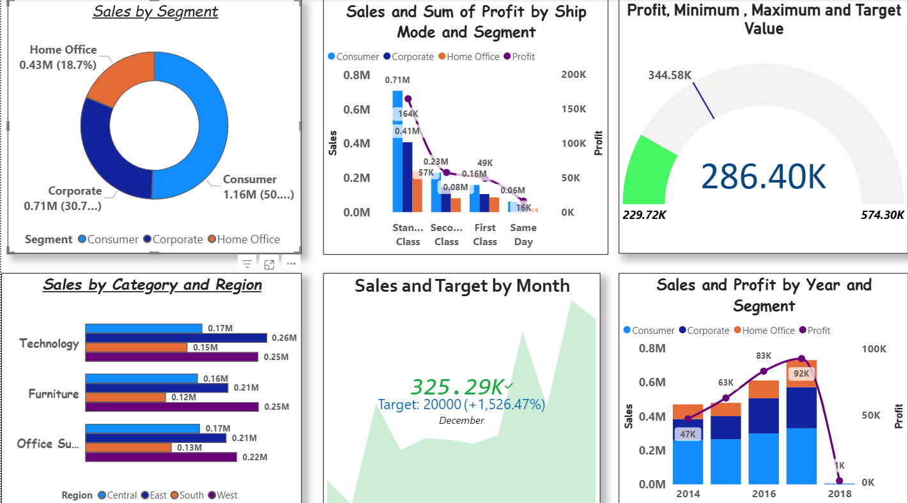

# 📊 Power BI Dashboard Development

## Overview

This repository contains my hands-on Power BI practice projects focused on transforming raw business data into interactive dashboards and actionable insights.

Using Power BI, Power Query, and DAX, I built reports that analyze sales performance, profitability, customer segments, and key business metrics through effective data visualization and reporting techniques.

---

## Dashboard Preview

---

## Key Features

### 📈 Business Performance Analysis
- Sales trend analysis
- Profit monitoring
- KPI tracking
- Category-wise performance

### 🎯 Interactive Reporting
- Dynamic filtering
- Drill-down analysis
- Business-focused visualizations
- User-friendly dashboard design

### 🧮 DAX & Analytics
- Calculated Measures
- Aggregations
- KPI Calculations
- Business Metrics

### 🔄 Data Transformation
- Data cleaning
- Data preparation
- Data modeling
- Power Query transformations

---

## Tools & Technologies

| Tool | Purpose |
|--------|---------|
| Microsoft Power BI | Dashboard Development |
| DAX | Analytical Calculations |
| Power Query | Data Transformation |
| Microsoft Excel | Data Source Preparation |

---

## Skills Demonstrated

- Data Visualization
- Dashboard Development
- KPI Design
- Business Reporting
- DAX Fundamentals
- Data Modeling
- Power Query
- Data Cleaning
- Analytical Thinking

---

## Project Files

| File | Description |
|--------|---------|
| visual_charts.pbix | Visualization and dashboard development |
| dax_functions.pbix | DAX calculations and measures practice |
| dv_sales_data.xlsx | Dataset used for analysis |

---

## What I Learned

- Designing interactive business dashboards
- Creating meaningful KPIs and metrics
- Writing DAX calculations for reporting
- Transforming data using Power Query
- Building data-driven reports for decision-making
- Presenting insights through visual storytelling

---

## Author

**Sagar Bairwa**

Aspiring Data Analyst | SQL | Power BI | Python | Excel

GitHub: https://github.com/sagar-bairwa
