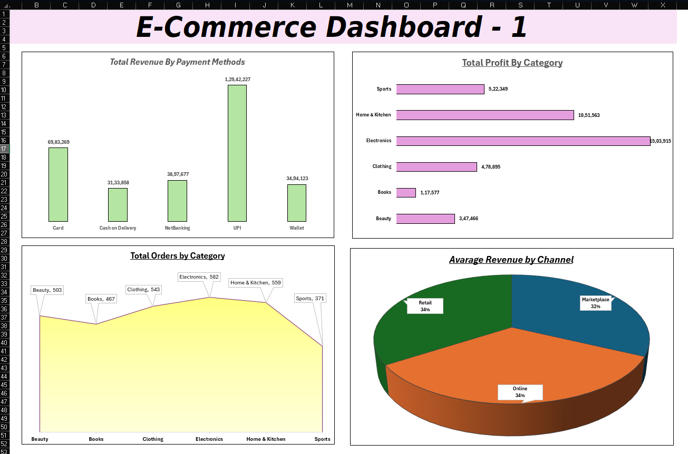
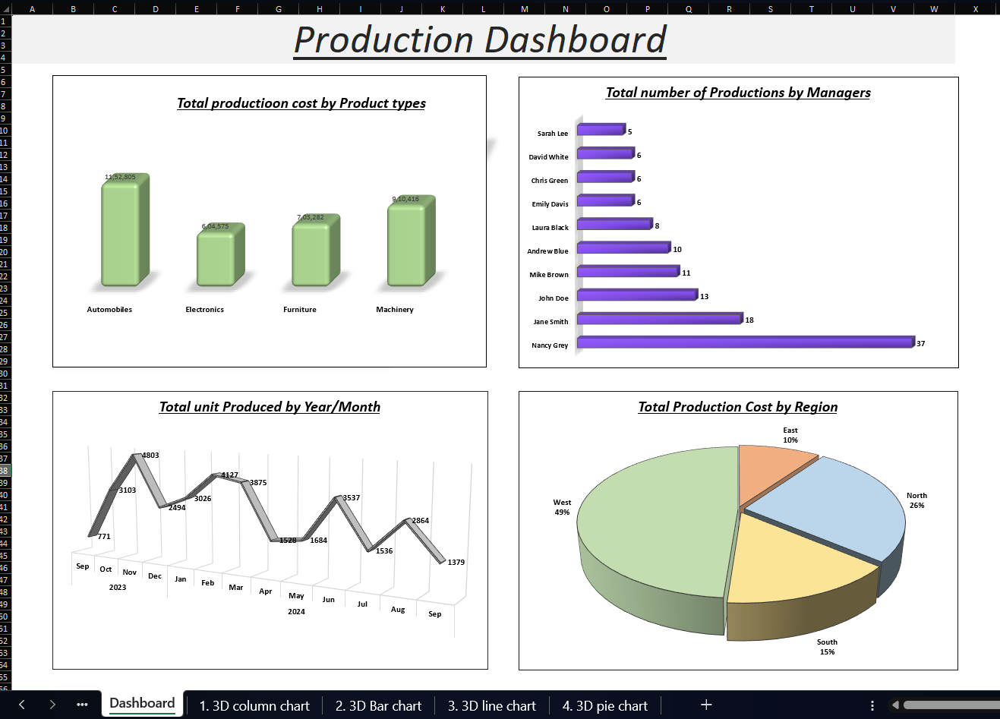

# 📈 Microsoft Excel Dashboard Projects

This section contains hands-on Excel dashboard projects created as part of my Data Analytics learning journey.

The focus was on transforming raw datasets into interactive dashboards using Pivot Tables, Charts, KPIs, and Excel reporting techniques.

## Projects Included

### 1. E-Commerce Sales Dashboard

A business dashboard built to analyze sales performance across different dimensions.

Key Insights:

- Revenue Analysis
- Profit Analysis
- Payment Method Performance
- Product Category Analysis
- Regional Performance
- Order Trends

Tools Used:

- Pivot Tables
- Pivot Charts
- Slicers
- Dashboard Design
- Excel Formulas

---

### 2. Production Analysis Dashboard

A dashboard focused on monitoring production activities and operational performance.

Key Insights:

- Production Cost Analysis
- Units Produced Analysis
- Manager Performance Tracking
- Regional Production Performance
- Cost Distribution Analysis

Tools Used:

- Pivot Tables
- 3D Charts
- Data Aggregation
- Dashboard Design

---

## Folder Structure

```text
04_ms_excel/
│
├── excel_dashboard_1/
│   ├── Ecommerce_Sales_Dashboard.xlsx
│   └── dashboard.png
│
├── excel_dashboard_2/
│   ├── production_analysis.xlsx
│   └── dashboard.png
│
└── README.md
```

## Dashboard Previews

### E-Commerce Sales Dashboard



### Production Analysis Dashboard



## Skills Developed

- Dashboard Development
- Data Visualization
- Pivot Tables
- Pivot Charts
- KPI Reporting
- Business Analysis
- Data Aggregation
- Excel Reporting

## Learning Outcome

Through these projects, I learned how to:

- Build interactive dashboards in Excel
- Analyze business and operational data
- Create reports using Pivot Tables and Charts
- Present insights through visual storytelling
- Transform raw data into decision-support reports
