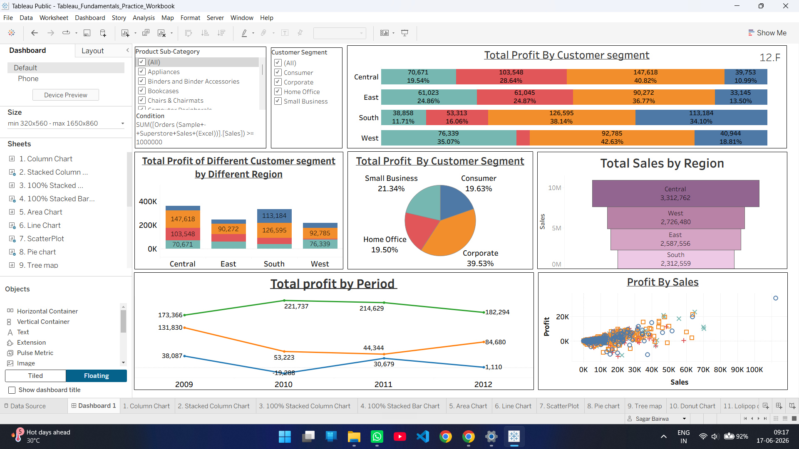

# 📊 Tableau Fundamentals Practice Workbook

> A hands-on Tableau learning project where I explored core data visualization techniques, chart creation, dashboard design, and Tableau fundamentals using the Superstore Sales dataset.

## 📌 Overview

This project was created as part of my Data Analytics learning journey to gain practical experience with Tableau.

Using the Superstore Sales dataset, I experimented with multiple visualization types and dashboard-building techniques to understand how data can be transformed into meaningful business insights.

The primary goal of this workbook was to build a strong foundation in Tableau before moving on to more advanced analytics and business-focused dashboard projects.

---

## 🛠️ Tools Used

- Tableau Public
- Microsoft Excel

---

## 📊 Skills & Concepts Practiced

- Dimensions & Measures
- Bar and Column Charts
- Line Charts
- Area Charts
- Pie Charts
- Treemaps
- Scatter Plots
- Donut Charts
- Packed Bubble Charts
- Symbol Maps
- Filters
- Dashboard Design
- Data Storytelling Fundamentals

---

## 📂 Dataset

**Dataset:** Superstore Sales Sample Dataset

The dataset includes information related to:

- Orders
- Sales
- Profit
- Products
- Customers
- Categories
- Regions

---

## 🔄 Learning Workflow

```text
Excel Dataset
      ↓
Data Exploration
      ↓
Visualization Creation
      ↓
Dashboard Design
      ↓
Workbook Development
```

---

## 📸 Workbook Preview



> Additional visualizations and worksheets are available inside the Tableau workbook.

---

## 🎯 Key Learning Outcomes

Through this project, I gained hands-on experience with:

- Connecting external datasets to Tableau
- Building multiple chart types
- Creating dashboards from scratch
- Applying filters and formatting
- Understanding visualization best practices
- Developing foundational data storytelling skills

---

## 📁 Project Structure

```text
tableau_fundamentals_practice_workbook
│
├── Tableau_Fundamentals_Practice_Workbook.twbx
├── superstore_sales_sample_data.xls
├── screenshots
│   └── dashboard.png
└── README.md
```

---

## 🚀 Why This Project Matters

This workbook represents my first practical step into Tableau and serves as the foundation for future Tableau projects involving real-world business analysis, interactive dashboards, and advanced data visualization techniques.

---

## 👨‍💻 Author

**Sagar Bairwa**

Aspiring Data Analyst

**Skills:** SQL • Python • Power BI • Tableau • Excel

GitHub: https://github.com/sagar-bairwa

LinkedIn: https://linkedin.com/in/sagarbairwa
