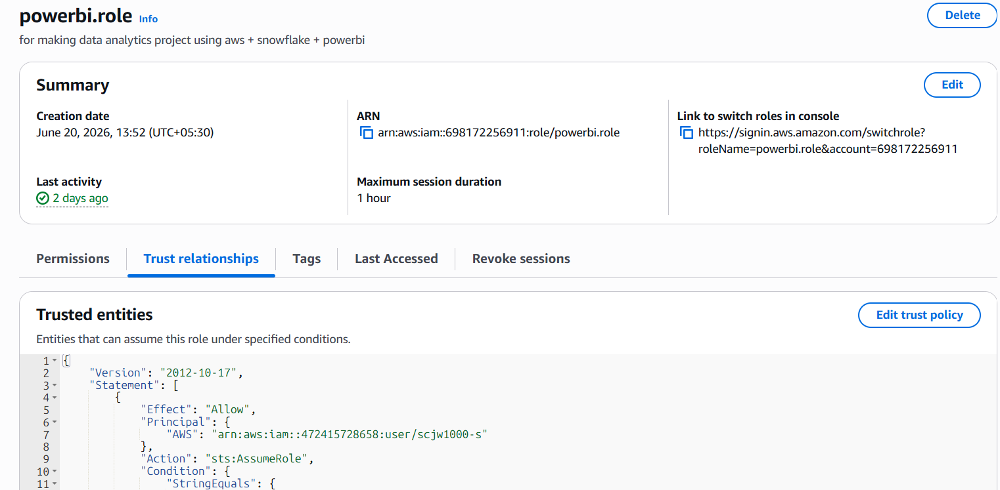
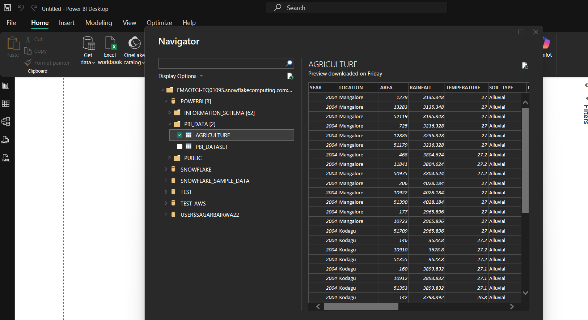
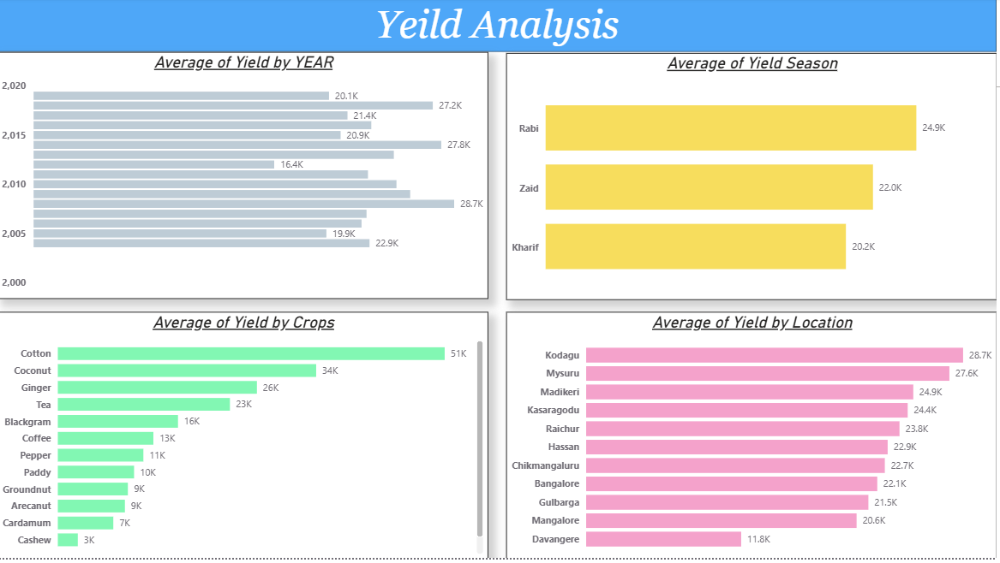

# AWS S3 to Snowflake Data Pipeline with Power BI

End-to-End Cloud Data Analytics Workflow using AWS S3, Snowflake, SQL, and Power BI.

## Overview

This project demonstrates how data can be ingested from AWS S3, securely integrated with Snowflake using IAM Roles and Storage Integrations, transformed using SQL, and consumed in Power BI for reporting.

## Architecture

AWS S3 → IAM Role & Trust Policy → Snowflake Storage Integration → External Stage → Snowflake Tables → SQL Transformation → Power BI

## Key Highlights

- Uploaded dataset to AWS S3
- Configured IAM Role and Trust Policy
- Created Snowflake Storage Integration
- Loaded data from S3 into Snowflake
- Performed SQL-based validation and transformation
- Connected Snowflake directly to Power BI
- Built reporting layer on top of Snowflake data

## Project Preview

### AWS ↔ Snowflake Integration



### Snowflake Connected to Power BI



### Final Reporting Layer



## Skills Demonstrated

AWS S3 • AWS IAM • Snowflake • Storage Integration • SQL • Data Warehousing • Data Transformation • Power BI

## Repository Structure

```text
dataset/
screenshots/
sql_powerrbi.sql
snowflake+aws.pbix
README.md
