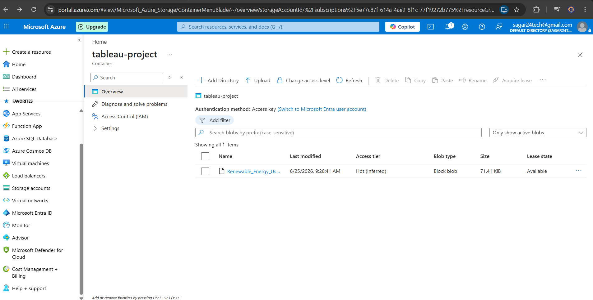

# Renewable Energy Analysis

### Azure Blob Storage • Snowflake • SQL • Tableau

End-to-End Cloud Data Pipeline for ingesting, transforming, and visualizing renewable energy consumption data using **Azure Blob Storage**, **Snowflake**, **SQL**, and **Tableau**.

---

## Project Overview

This project demonstrates a modern cloud analytics workflow where renewable energy consumption data is stored in **Azure Blob Storage**, securely loaded into **Snowflake** using **Azure Storage Integration**, transformed with SQL, and visualized through an interactive Tableau dashboard.

---

## Workflow

```text
Renewable Energy Dataset
        ↓
Azure Blob Storage
        ↓
Snowflake Storage Integration
        ↓
External Stage
        ↓
Snowflake Tables
        ↓
SQL Validation & Transformation
        ↓
Tableau Dashboard
```

---

## Implementation Steps

* Uploaded the renewable energy dataset to Azure Blob Storage.
* Created an Azure Storage Account and Blob Container.
* Configured Azure Storage Integration in Snowflake.
* Created an External Stage pointing to the Azure Blob Container.
* Loaded data from Azure Blob Storage into Snowflake tables.
* Validated and transformed data using SQL.
* Connected Snowflake directly to Tableau.
* Built an interactive Renewable Energy Dashboard in Tableau.

---

## Project Preview

### Azure Blob Storage

Dataset stored securely inside an Azure Blob Storage container before ingestion into Snowflake.



### Snowflake Storage Integration

Storage Integration and External Stage configured to securely access Azure Blob Storage.


### Renewable Energy Dashboard

Interactive Tableau dashboard built on transformed Snowflake data.


---

## Live Dashboard

Explore the interactive Tableau dashboard online:

🔗 **Tableau Public:** *(Add your Tableau Public link here)*

📁 **Tableau Workbook Included:** `energy_consumption_dashboard.twbx`

---

## Skills Demonstrated

* Azure Blob Storage
* Azure Storage Account
* Snowflake Storage Integration
* External Stage Configuration
* Cloud Data Warehousing
* SQL Data Transformation
* Data Validation
* Tableau Dashboard Development
* End-to-End Cloud Analytics Pipeline

---

## Repository Structure

```text
azure_blob_snowflake_tableau/

├── dataset/
│   └── renewable_energy_usage_sampled.csv
│
├── screenshots/
│   ├── azure_integration.png
│   ├── sql_storage_integration.png
│   └── dashboard.png
│
├── azure_ETL.sql
├── energy_consumption_dashboard.twbx
└── README.md
```

---

## Technologies Used

* Microsoft Azure Blob Storage
* Snowflake
* SQL
* Tableau Desktop
* Tableau Public

---

## Author

**Sagar Bairwa**

B.Tech CSE | Aspiring Data Analyst

**Skills:** SQL • Tableau • Power BI • Python • Snowflake • Azure
