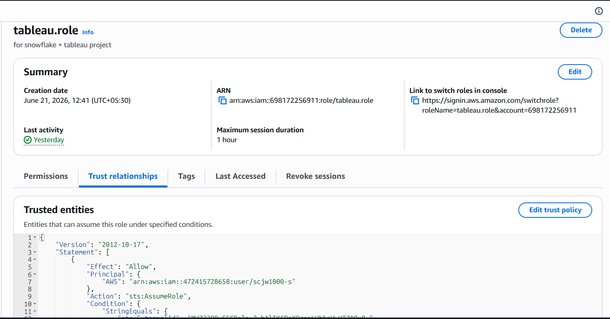
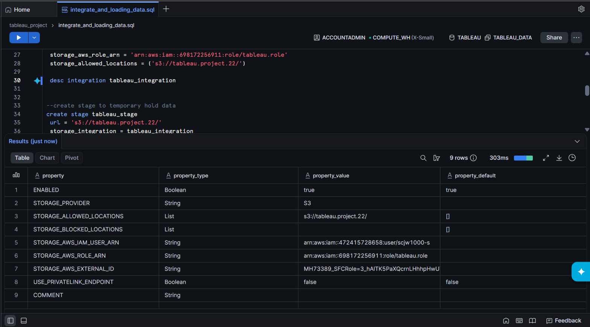
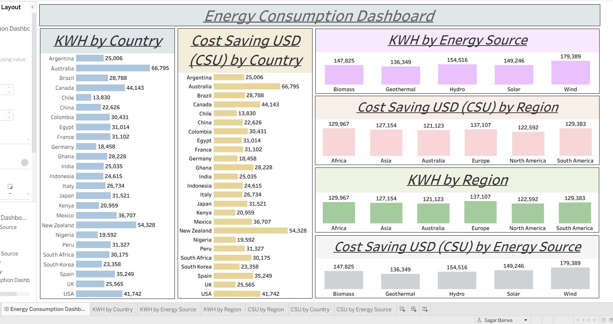

# Renewable Energy Analytics Pipeline
### AWS S3 • Snowflake • SQL • Tableau

End-to-End Cloud Data Pipeline for ingesting, transforming, and visualizing renewable energy consumption data using AWS S3, Snowflake, SQL, and Tableau.

---

## Project Overview

This project demonstrates a modern cloud analytics workflow where renewable energy consumption data is stored in AWS S3, loaded into Snowflake through Storage Integrations, transformed using SQL, and visualized in Tableau through an interactive dashboard.

---

## Workflow

```text
Renewable Energy Dataset
        ↓
AWS S3 Bucket
        ↓
IAM Role & Trust Policy
        ↓
Snowflake Storage Integration
        ↓
External Stage
        ↓
Snowflake Tables
        ↓
SQL Validation & Transformation
        ↓
Tableau Dashboard
```

### Implementation Steps

- Uploaded renewable energy dataset to AWS S3
- Configured IAM Role and Trust Policy
- Created Snowflake Storage Integration
- Created External Stage for secure data ingestion
- Loaded data into Snowflake tables
- Performed SQL-based validation and transformation
- Connected Snowflake directly to Tableau
- Developed an interactive Renewable Energy Dashboard

---

## Project Preview

### AWS ↔ Snowflake Integration

IAM Role and Trust Policy used for secure communication between AWS S3 and Snowflake.



### Snowflake Storage Integration

Storage Integration validation and stage configuration inside Snowflake.



### Renewable Energy Dashboard

Interactive Tableau dashboard built on transformed Snowflake data.



---

## Live Dashboard

Explore the interactive Tableau dashboard online:

🔗 **Tableau Public:**  
PASTE_YOUR_TABLEAU_PUBLIC_LINK_HERE

📁 Tableau Workbook Included: `energy_consumption_dashboard.twbx`

---

## Skills Demonstrated

- AWS S3 & IAM
- Snowflake Storage Integration
- Cloud Data Warehousing
- SQL Data Transformation
- Data Validation
- Tableau Dashboard Development
- End-to-End Analytics Workflow

---

## Repository Structure

```text
aws_s3_snowflake_tableau/

├── dataset/
│   └── renewable_energy_usage_sampled.csv
│
├── screenshots/
│   ├── aws_integration.png
│   ├── sql_storage_integration.png
│   └── dashboard.png
│
├── integrate_and_load_data.sql
├── energy_consumption_dashboard.twbx
└── README.md
```

---

## Author

**Sagar Bairwa**

B.Tech CSE | Aspiring Data Analyst

SQL • Tableau • Power BI • Python • Snowflake • AWS
