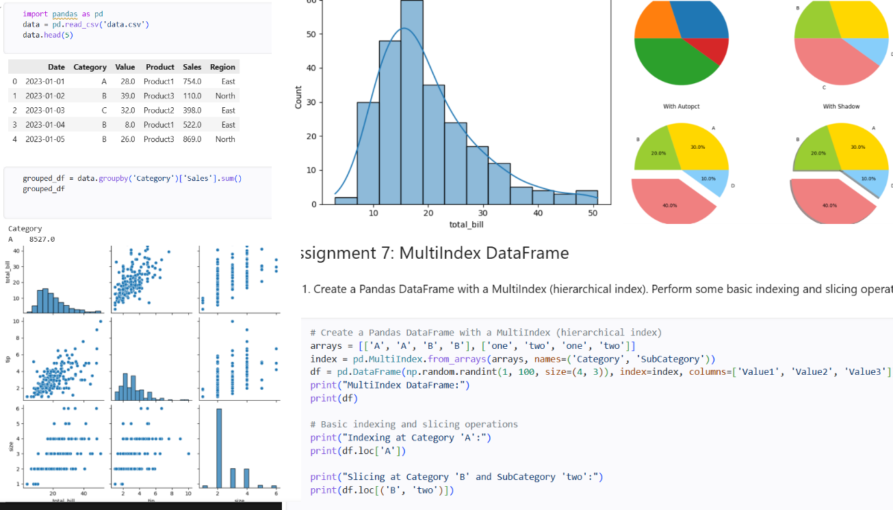

# Data Analytics Learning Track 📊

# Hi, I'm Sagar 👋

### B.Tech CSE Student | Aspiring Data Analyst | Power BI • SQL • Python

Welcome to my **Data Analytics Learning Journey Repository** 📊

This repository showcases my hands-on learning journey in Data Analytics through:
- Python projects
- SQL problem solving
- Power BI dashboards
- Data visualization
- Practical assignments
- Real-world datasets

I focus on learning by building and practicing consistently instead of only consuming tutorials.

---

# 🚀 Tech Stack

---

# 📂 Repository Structure

| Folder | Description |
|---|---|
| `01_python_libraries` | Python practice, EDA, visualization & assignments |
| `02_ms_sql` | SQL queries, joins, aggregations & database practice |
| `03_power_bi` | Power BI dashboards, DAX & visual analytics |

---

# 📁 Python Libraries Practice

Topics Covered:
- NumPy
- Pandas
- Matplotlib
- Seaborn
- Data Cleaning
- Exploratory Data Analysis
- GroupBy Operations
- MultiIndex DataFrames

### Preview

---

# 📁 Microsoft SQL Server Practice

Topics Covered:
- SELECT Queries
- WHERE Clause
- GROUP BY & HAVING
- SQL Joins
- CASE Statements
- LIKE Operator
- Aggregate Functions
- Duplicate Handling

### Preview

---

# 📁 Power BI Dashboards

Topics Covered:
- Dashboard Building
- KPI Analysis
- Interactive Reports
- DAX Functions
- Data Modeling
- Business Insights

### Dashboard Preview

---

# 📈 Current Progress

✅ Python Fundamentals  
✅ NumPy & Pandas  
✅ SQL Basics & Joins  
✅ Power BI Fundamentals  
✅ Dashboard Building  

🔄 Currently Learning:
- Advanced SQL
- DAX
- Statistics
- End-to-End Analytics Projects

---

# 🎯 Career Goal

My goal is to become a job-ready Data Analyst by developing:
- strong analytical thinking
- practical project experience
- dashboard development skills
- business problem-solving ability

---

# 🌱 Learning Philosophy

> Learn → Practice → Build → Improve → Repeat

---

# 📬 Connect With Me

### LinkedIn
(Add your LinkedIn profile link)

### GitHub
(Add your GitHub profile link)

---

⭐ Thanks for visiting my repository!
